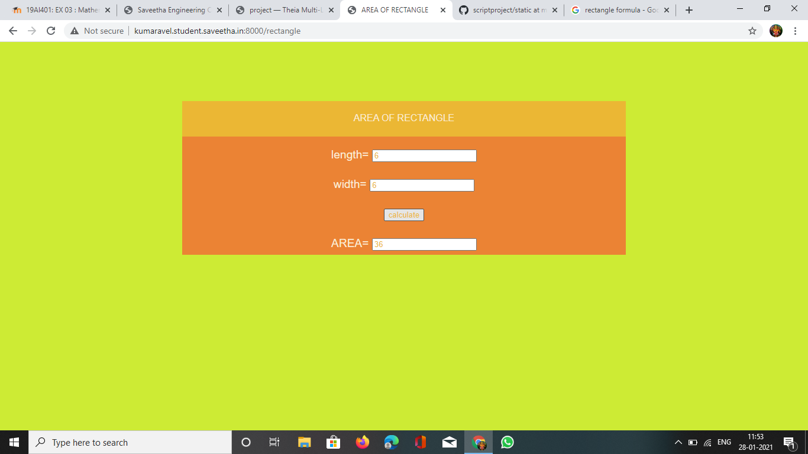
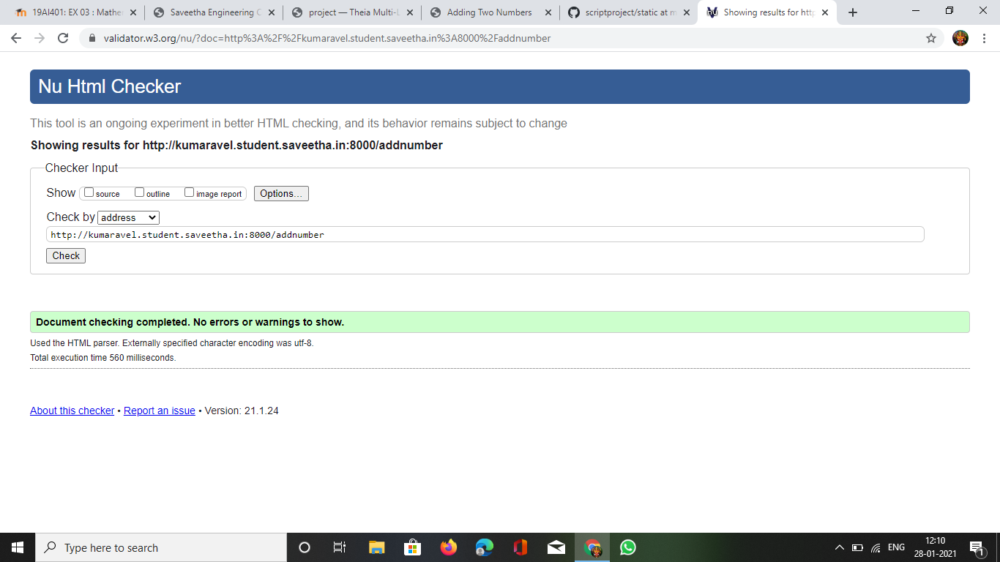

# Mathematical Calculations using JavaScript
## AIM:
To design a website to calculate the area of a rectangle and add two number using JavaScript.

## DESIGN STEPS:
### Step 1: 
Requirement collection.
### Step 2:
Creating the layout using HTML and CSS.
### Step 3:
Write JavaScript to perform calculations.
### Step 4:
Choose the appropriate style and color scheme.
### Step 5:
Validate the layout in various browsers.
### Step 6:
Validate the HTML code.
### Step 6:
Publish the website in the given URL.


## PROGRAM:

### addnumber.html
```

<!DOCTYPE html>
<html lang="en">

<head>
    <title>Adding Two Numbers</title>
    <link rel="stylesheet" href="">
</head>

<body>
    <div class="container">
        <div class="formview">
            <div class="banner">
                ADD TWO NUMBERS
            </div>
            <div class="content">
                <form action="addnumber.html" method="GET">
                    
                    <div class="forminput">
                        <label for="value_a">A=</label>
                        <input type="text" name="value_a" id="value_a">
                    </div>
                    <div  class="forminput">
                        <label for="value_b">B=</label>
                        <input type="text" name="value_b" id="value_b">
                    </div>                    
                    <div class="forminput">
                        <button type="button" name="button_add" id="button_add">Add</button>
                    </div>
                    <div  class="forminput">
                        <label for="value_c">C=</label>
                        <input type="text" name="value_c" id="value_c" readonly>
                    </div>                    
                </form>
            </div>
        </div>
    </div>
    <script src="/static/js/maths.js"></script>
</body>

</html>
```
### maths.js
```
addBtn = document.querySelector('#button_add');

addBtn.addEventListener('click',function(e){

    txtA = document.querySelector('#value_a');
    txtB = document.querySelector('#value_b');
    txtC = document.querySelector('#value_c');

    let c;

    c = parseFloat(txtA.value) + parseFloat(txtB.value);

    txtC.value = c;
});
```

### rectangle.html

```

<!DOCTYPE html>
<html lang="en">

<head>
    <title>AREA OF RECTANGLE</title>
    <link rel="stylesheet" href="">
</head>

<body>
    <div class="container">
        <div class="formview">
            <div class="banner">
               AREA OF RECTANGLE 
            </div>
            <div class="content">
                <form action="rectangle.html" method="GET">
                    
                    <div class="forminput">
                        <label for="value_a">length=</label>
                        <input type="text" name="value_a" id="value_a">
                    </div>
                    <div  class="forminput">
                        <label for="value_b">width=</label>
                        <input type="text" name="value_b" id="value_b">
                    </div>                    
                    <div class="forminput">
                        <button type="button" name="button_calculate" id="button_calculate">calculate</button>
                    </div>
                    <div  class="forminput">
                        <label for="value_c">AREA=</label>
                        <input type="text" name="value_c" id="value_c" readonly>
                    </div>                    
                </form>
            </div>
        </div>
    </div>
    <script src="/static/js/mathsrectangle.js"></script>
</body>

</html>

```

### mathsrectangle.js

```
addBtn = document.querySelector('#button_calculate');

addBtn.addEventListener('click',function(e){

    txtA = document.querySelector('#value_a');
    txtB = document.querySelector('#value_b');
    txtC = document.querySelector('#value_c');

    let c;

    c = parseFloat(txtA.value) * parseFloat(txtB.value);

    txtC.value = c;
});
```
### volumecylinder.html
```

<!DOCTYPE html>
<html lang="en">

<head>
    <title>volume of cylinder</title>
    <link rel="stylesheet" href="">
</head>

<body>
    <div class="container">
        <div class="formview">
            <div class="banner">
               VOLUME OF CYLINDER
            </div>
            <div class="content">
                <form action="volumecylinder.html" method="GET">
                    
                    <div class="forminput">
                        <label for="value_radius">RADIUS=</label>
                        <input type="text" name="value_radius" id="value_radius">
                    </div>
                    <div  class="forminput">
                        <label for="value_height">HEIGHT=</label>
                        <input type="text" name="value_height" id="value_height">
                    </div>                    
                    <div class="forminput">
                        <button type="button" name="button_calculate" id="button_calculate">calculate</button>
                    </div>
                    <div  class="forminput">
                        <label for="value_volume">VOLUME=</label>
                        <input type="text" name="value_volume" id="value_volume" readonly>
                    </div>                    
                </form>
            </div>
        </div>
    </div>
    <script src="/static/js/mathscylindervolume.js"></script>
</body>

</html>

```
### mathscylindervolume.js
```
calcBtn = document.querySelector('#button_calculate');

calcBtn.addEventListener('click',function(e){

    txtA = document.querySelector('#value_radius');
    txtB = document.querySelector('#value_height');
    txtC = document.querySelector('#value_volume');

    let c;

    c = parseFloat(txtA.value) * parseFloat(txtB.value);

    txtC.value = c;
});
```

## OUTPUT:




## CODE VALIDATION REPORT:



## RESULT:
Thus a website is designed for the add two numbers and is hosted in the URL http://adhil.student.saveetha.in:8000/addnumber. HTML code is validated.

Thus a website is designed for the cluculate area of rectangle and is hosted in the URL http://adhil.student.saveetha.in:8000/rectangle. HTML code is validated.

Thus a website is designed for the cluculate area of rectangle and is hosted in the URL http://adhil.student.saveetha.in:8000/volumecylinder. HTML code is validated.